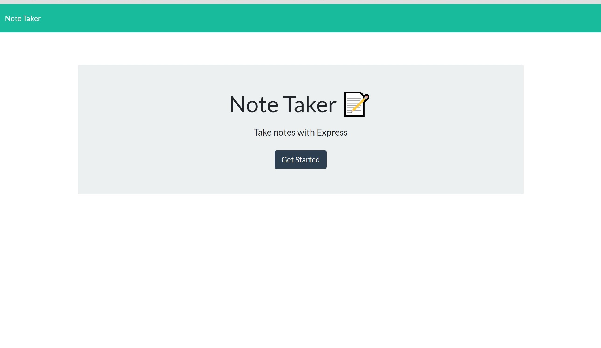
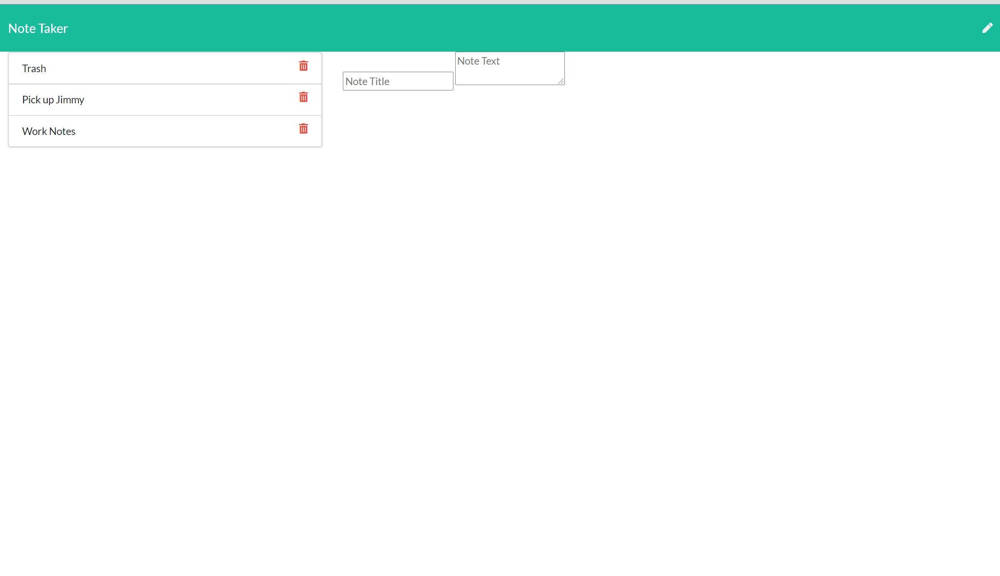

# 11-Note-Taker

## Description
As a Full-Stack Web Developer, I have created an application that will allow me to write, save, and delete notes.. I have created this application so that I can organize my thoughts and keep track of tasks I need to complete.. In order to achieve this, I will utilize Express to save user input.

## Table of Contents

* [Title](#Title)
* [Description](#Description)
* [Usage](#Usage)
* [Contributing](#Contributing)

## Usage
Click "Get Started" to be taken to your notes. Enter a title and your notes, then click the save button in the top right corner of the web page. Click the "trash can" icon by your note to delete it.

## Contributors
Just me!

## Questions
Coreyburkett22@gmail.com

